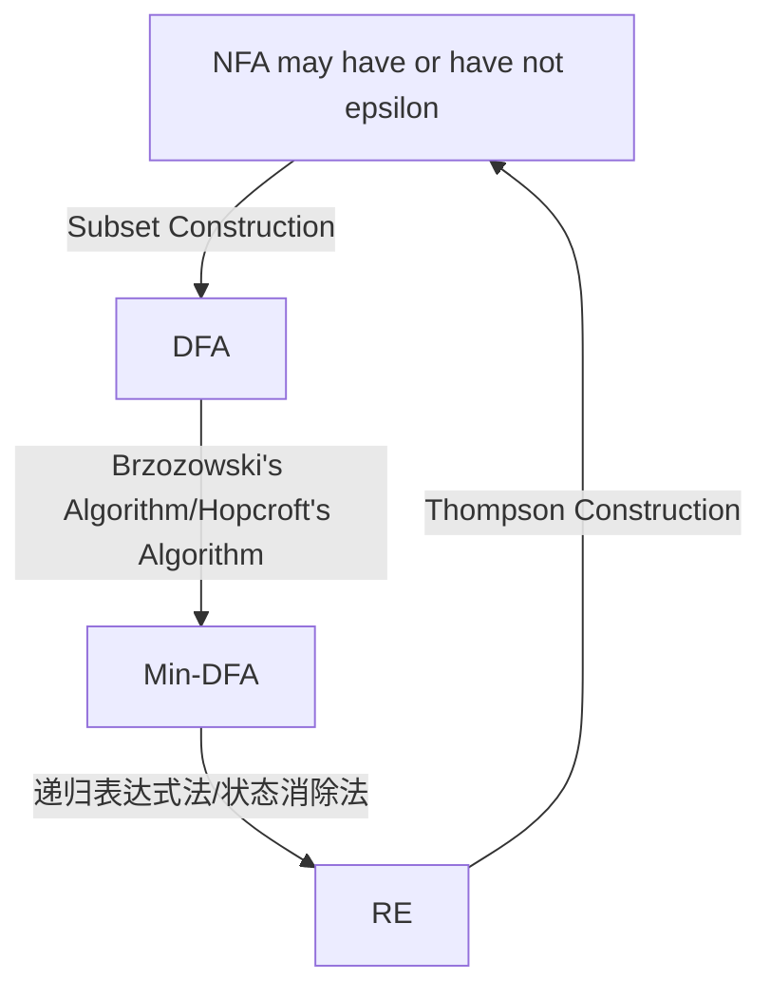

> Computation with automata.

<!-- more -->

## Glossary

- NFA: Non-Deterministic Finite Automata 非确定性的有限状态自动机
- DFA: Deterministic Finite Automata 确定性的有限状态自动机
- Min-DFA: Minimal Deterministic Finite Automata 最小的DFA
- RE: Regular Expression 正则表达式
- RG: Regular Grammar 正则文法

## NFA,DFA,Min-DFA,RE的关系

一般地，认为NFA, DFA, Min-DFA, RE的关系如下

