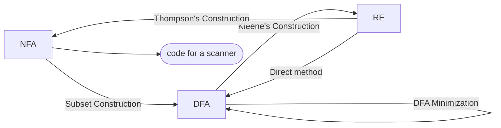

> Computation with automata.

<!-- more -->

## Glossary

- NFA: Non-Deterministic Finite Automata 非确定性的有限状态自动机
  - 对于NFA的非确定, 有两种有趣的解释
    1. 在需要做出不确定选择的时候, NFA会复制自己并执行所有的操作, 如果最终有任何一台自动机到达了接收状态, 那么NFA接收这个输入
    2. 在需要做出不确定选择的时候, NFA的选择总是正确, 也就是说, 只要这个串是能被接收的, 那NFA一定能选对
- DFA: Deterministic Finite Automata 确定性的有限状态自动机
- Min-DFA: Minimal Deterministic Finite Automata 最小的DFA
- RE: Regular Expression 正则表达式
- RG: Regular Grammar 正则文法

## NFA,DFA,Min-DFA,RE的关系

一般地，认为NFA, DFA, Min-DFA, RE的关系如下




DFA Minimization有两种算法: Brzozowski, Hopcroft.

## RE to NFA: Thompson Construction

先看正则表达式的结构, 这里就不那么形式化了, 用Haskell的语法写了=_=


```haskell
data RegExp
    = Symbol Char          -- Basic Character a
    | Concat RegExp RegExp -- Concatenation   ab
    | Union  RegExp RegExp -- Union           a+b
    | Star   RegExp        -- Kleene star     a*
```

- 当`RegExp`是`Symbol a`时

  ```mermaid
  stateDiagram-v2
  	direction LR
  	s0
  	s1
  	[*]-->s0
  	s0-->s1:a
  	s1-->[*]
  ```

- 当`RegExp`是`Concat e1 e2`时

  ```mermaid
  stateDiagram-v2
  	direction LR
  	%% e1-->e2:ε
  	s1-->s3:ε
  	state e1{
  		direction LR
  		[*]-->s0
  		s0-->s1
  	}
  	state e2{
  		direction LR
  		s3-->s4
  		s4-->[*]
  	}
  ```


- 当`RegExp`是`Union e1 e2`时

  ```mermaid
  stateDiagram-v2
  	direction LR
  	[*]-->s0
  	s0-->s1:ε
  	s0-->s3:ε
  	s2-->s5:ε
  	s4-->s5:ε
  	s5-->[*]
  	state e1{
  		direction LR
  			s1-->s2
  	}
  	state e2{
  		direction LR
  			s3-->s4
  	}
  ```


- 当`RegExp`是`Star e`时

  ```mermaid
  stateDiagram-v2
  	direction LR
  	[*]-->s0
  	s0-->s1:ε
  	
  	s2-->s3:ε
  	s3-->[*]
        s0-->s3:ε
  	state e{
  		direction LR
  		s1-->s2
  		s2-->s1:ε
  	}
  ```


> 做题的时候一定不要图省事, 省略某些步骤; 严格按照这四个pattern来, 会让你避免很多麻烦
{: .prompt-tip }

## NFA to DFA: 子集构造法

子集构造法有两个重要的函数
  - $\text{Move}(s_i, a)$, 返回从状态$s_i$接收输入$a$能到达的状态集合
  - $\text{FollowEpsilon}(s_i)$, 返回从状态$s_i$接收$\epsilon$能到达的状态集合, 包括$s_i$本身和经过多次空转移到达的状态

用自然语言描述这个算法就是:
  1. 从NFA的起始状态$n_0$构造出DFA的起始状态$d_0$
     - $d_0 = \text{FollowEpsilon}(\{n_0\})$
     - 令$D = \{d_0\}$
  2. 对所有$\alpha\in \Sigma$, 计算$\text{FollowEpsilon}(\text{Move}(d_0, \alpha))$
     - 如果这一步算出了新状态, 将其加入$D$
  3. 遍历$D$, 对每个状态计算$\text{FollowEpsilon}(\text{Move}(d_0, \alpha))$, 直到没有新状态产生为止 
     - 子集构造法也涉及到不动点问题. 

用伪代码则是:

$$
\begin{align*}
&d_0 \leftarrow \text{FollowEpsilon}({n_0})  \\
&D \leftarrow \{d_0\}  \\
&W \leftarrow \{d_0\}  \\
&\text{while }(W \ne \emptyset)\ \{ \\
  &\quad\text{从}W\text{里随便选择并删除一个元素}s\\
  &\quad\text{for each } \alpha \in \Sigma\ \{ \\
    &\quad\quad t \leftarrow \text{FollowEpsilon}(\text{Move}(s, a))\\
    &\quad\quad T[s, \alpha]\leftarrow t \\
    &\quad\quad \text{if }(t \notin D) \text{ then \{}\\
      &\quad\quad\quad \text{向}D\text{里添加}t\\
      &\quad\quad\quad \text{向}W\text{里添加}t\\
    &\quad\quad\}\\
  &\quad\}\\
&\}
\end{align*}
$$

容易知道, 子集构造法本质上就是合并了不同状态的相同前缀, 因为在DFA里的每个状态都是由NFA里的一个状态$s_i$经过空串或一个字母$\alpha$迁移过来的.

## DFA to Minimal DFA

状态机里可能存在冗余的状态, 也是说有多个状态无法找到一个输入串区分它们, 形式化的描述是:

  $$s_i\text{和}s_j\text{是等价状态} \Leftrightarrow \forall c\in \Sigma, T(s_i, c) = T(s_j, c) \land \text{Path}(s_0, s_i) = \text{Path}(s_0, s_j) $$

### Brzozowski’s algorithm

核心想法: 既然子集构造法能合并相同前缀的状态, 那我能不能再利用子集构造法合并冗余状态呢? 冗余就是那些前缀相同和后缀相同的状态, 那么我把状态机翻过来做一次子集构造法不就能合并后缀, 再翻过来做一次子集构造法不就把前缀也合并了.

基于上面这个想法, *Brzozowski*设计了如下的算法进行DFA的最小化.

- 将NFA翻转过来, 得到NFA'
- 对NFA'执行子集构造法得到DFA', 此时完成了后缀合并, 但这个时候自动机是反的
- 将DFA'翻转过来得到NFA'', 对NFA''进行子集构造法, 就完成了前缀的合并, 并且自动机也翻回正向的了

翻转自动机的方法: 将原自动机的边翻转, 原自动机的起始状态成为终止状态, 原自动机的终止状态成为起始状态, 如果原自动机有多个终止状态那就新增一个状态$s_e$, 所有原终止状态通过$\epsilon$转移到$s_e$即可继续翻转.

### Hopcroft’s algorithm

核心想法: Hopcroft的想法更直接, 基本的idea就是: 最小化DFA不就是把等价的状态**划分**到一起, 那不就是找原状态机里的一个划分, 把等价的状态放到一起, 划分的每个组内的状态相互不可区分,  然后用这个划分组成新的自动机.

我们希望这个划分应该有什么性质才能保证DFA是最小的呢? 假定最后的划分是$P=\{p_0, p_1, p_2, \dots p_n\}$, $P$应该有这样的性质:

1. 如果$d_i, d_j \in p_s$并且如果有$c$使得$d_i\to d_x, d_j\to d_y$, 那么$d_x, d_y\in p_t$
2. 如果$d_i, d_j \in p_s$并且$d_i\in F$, 那么$d_j\in F$($F$是接收状态集合)

具体的运算过程:

1. 先乐观地将所有状态划分为两个组: 接收状态组和其他状态组, (这是因为我们希望最终得到的划分组数最少)
2. 从当前划分中任意选取一个状态组, 检查是否存在一个字母$c$使得组内的状态迁移到不同的组内, 如果存在那就按照这些迁移将该组进行划分, 使得划分后的一个状态组内的每个状态在字母$c$下都迁移到同一个组内. 重复执行该步骤直到无法根据某个字母对任何一个组进行分割为止.

伪代码:

$$
\begin{align*}
&worklist \leftarrow \{F, \{D-F\}\} \\
&partition \leftarrow \{F, \{D-F\}\} \\
&\text{while }(worklist \ne \emptyset) \text{ \{} \\
&\quad \text{从}worklist\text{中选取并移除一个状态组}S \\
&\quad \text{for each } \alpha \in \Sigma \text{ \{} \\
&\quad \quad image \leftarrow \{x \vert \delta (x, \alpha) \in S \} \\
&\quad \quad \text{for each } q \in partition \text{ that has a state in image \{} \\
&\quad \quad \quad q_1 \leftarrow q \cap image \\
&\quad \quad \quad q_2 \leftarrow q - q_1 \\
&\quad \quad \quad \text{if } q_2 \ne \emptyset \text{ \{} \\
&\quad \quad \quad \quad \text{从}partition\text{中移除}q \\
&\quad \quad \quad \quad partition \leftarrow partition \cup q_1 \cup q_2 \\
&\quad \quad \quad \quad \text{if } q \in worklist \text{ \{} \\
&\quad \quad \quad \quad \quad \text{从}worklist\text{中移除}q \\
&\quad \quad \quad \quad \quad worklist \leftarrow worklist \cup q_1 \cup q_2 \\
&\quad \quad \quad \quad \text{else } \text{if } \vert q_1 \vert \le \vert q_2 \vert \text{ \{} \\
&\quad \quad \quad \quad \quad worklist \leftarrow worklist \cup q_1 \\
&\quad \quad \quad \quad \text{else } \\
&\quad \quad \quad \quad \quad worklist \leftarrow worklist \cup q_2 \\
&\quad \quad \quad \quad \} \\
&\quad \quad \quad \quad \text{if } s = q \text{ \{} \\
&\quad \quad \quad \quad \quad break; \\
&\quad \quad \quad \quad \} \\
&\quad \quad \quad \} \\
&\quad \quad \} \\
&\quad \} \\
&\} \\
\end{align*}
$$


## DFA to RE: Kleene's construction

定理: 如果$L=L(A)$是某DFA $A$的语言, 那么存在正则表达式$R$满足$L=L(R)$

进行转换的基本idea: $R_{ij} = R_{ij}^{不经过k}+R_{ik}^{不经过k}(R_{kk}^{不经过k})^*R_{kj}^{不经过k}$

- 定理及证明:

  对DFA $A$的状态编号, 令1为开始状态, 即

    $$A=(\{1, 2, \dots, n\}, \Sigma, \delta, 1, F)$$

  设正则表达式$R_{ik}^{(k)}$表示从$i$到$j$但中间节点标号不超过$k$全部路径的字符串集合

    $$R_{ij}^{(k)} = \{ x | \hat \delta(i, x) = j, x经过的状态除两端外标号不超过k\}$$

  那么与$A=(\{1, 2, \dots, n\}, \Sigma, \delta, 1, F)$等价的正则表达式为

    $$\bigcup_{j\in F}R_{1j}^{(n)}$$

  且递归式为

    $$R_{ij}^{(k)} = R_{ij}^{(k-1)} + R_{ik}^{(k-1)}(R_{kk}^{(k-1)})^*R_{kj}^{(k-1)}$$

    $$
    R_ij^{(0)} = 
    \begin{cases}
    \{\alpha | \delta(q_i, \alpha) = q_j\} & i\ne j \\
    \{\alpha | \delta(q_i, \alpha) = q_j\} \cup \{\epsilon\} & i = j \\
    \end{cases}
    $$

  Base case: 
  - 当$i\ne j, k = 0$时, 即$i$到$j$没经过任何中间结点

    - 没有$i$到$j$的状态转移
    ```mermaid
    graph LR
    i((i))
    j((j))
    ```
    $R_{ij}^{(0)}=\emptyset$

    - 有一个$i$到$j$的状态转移
    ```mermaid
    graph LR
    i((i))
    j((j))
    i--a-->j
    ```
    $R_{ij}^{(0)}=a$

    - 有多个$i$到$j$的状态转移
    ```mermaid
    graph LR
    i((i))
    j((j))
    i--a-->j
    i--b-->j
    i--c-->j
    ```
    $R_{ij}^{(0)}=a+b+c$

  - 当$i = j, k = 0$时, 即从$i$到自身没经过任何中间结点
    - 状态$i$没有到自己的转移
      ```mermaid
      graph LR
      i((i))
      ```
      $R_{ii}^{(0)} = \varepsilon$
    - 状态$i$有一个到自身的转移
      ```mermaid
      graph LR
      i((i))
      i--a-->i
      ```
      $R_{ii}^{(0)} = a + \varepsilon$
    - 状态$i$有多个到自身的转移
      ```mermaid
      graph LR
      i((i))
      i--a-->i
      i--b-->i
      i--c-->i
      ```
      $R_{ii}^{(0)} = a + b + c \varepsilon$

